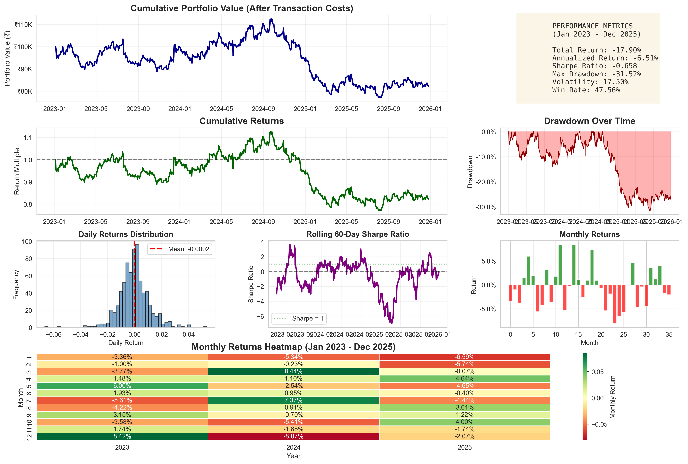

# SPARQ Momentum Trading Strategy

A machine learning-based momentum trading strategy for the Indian stock market using ensemble learning, technical indicators, and realistic portfolio backtesting.

---

## Overview

This project implements an end-to-end quantitative momentum trading strategy using machine learning on real National Stock Exchange (NSE) historical data.

The objective is to predict short-term stock momentum and construct a long-only portfolio by selecting the top-performing stocks every week.

The project follows standard quantitative research practices, including:

- Strict train-test separation
- Real market data
- Transaction cost modeling
- Weekly portfolio rebalancing
- Out-of-sample evaluation
- Comprehensive performance analysis

Rather than focusing only on profitable results, this project emphasizes robust methodology, reproducibility, and transparent reporting.

---

## Strategy Workflow

```
Historical Market Data
        │
        ▼
Feature Engineering
(41 Technical Indicators)
        │
        ▼
Voting Classifier
(Random Forest +
Gradient Boosting +
Logistic Regression +
AdaBoost)
        │
        ▼
Stock Ranking
        │
        ▼
Top 2 Stock Selection
        │
        ▼
Equal Weight Portfolio
        │
        ▼
Weekly Rebalancing
        │
        ▼
Portfolio Backtesting
        │
        ▼
Performance Evaluation
```

---

## Dataset

### Market

National Stock Exchange (NSE)

### Stock Universe

- RELIANCE
- TCS
- INFY
- HDFCBANK
- ICICIBANK
- BHARTIARTL
- BAJFINANCE
- HINDUNILVR
- HCLTECH
- MARUTI

### Data Period

| Stage | Duration |
|--------|----------|
| Training | Jan 2015 – Dec 2022 |
| Testing | Jan 2023 – Dec 2025 |

Total trading days: **2717**

---

## Feature Engineering

The model generates 41 engineered features from historical price and volume data.

### Momentum Features

- 5-day return
- 10-day return
- 21-day return
- 42-day return
- 63-day return
- Log returns

### Technical Indicators

- Simple Moving Averages (SMA)
- Exponential Moving Averages (EMA)
- MACD
- RSI
- Bollinger Bands

### Volatility Features

- Rolling standard deviation
- High-Low ratios
- Momentum strength

### Volume Features

- Volume moving averages
- Volume trends
- Price-volume correlation

---

## Machine Learning Model

The prediction model is a Soft Voting Classifier consisting of four algorithms.

| Model | Purpose |
|--------|----------|
| Random Forest | Captures non-linear relationships |
| Gradient Boosting | Sequential error correction |
| Logistic Regression | Linear baseline model |
| AdaBoost | Adaptive ensemble learning |

The ensemble generates prediction probabilities that are used to rank stocks every week.

---

## Portfolio Construction

The portfolio construction process consists of:

1. Predict weekly returns for all stocks.
2. Rank stocks by predicted probability.
3. Select the top two stocks.
4. Allocate 50% capital to each stock.
5. Rebalance every week.
6. Apply transaction costs.

Portfolio assumptions:

- Long-only strategy
- Equal-weight allocation
- Weekly rebalancing
- Transaction cost: 10 basis points per trade side

---

## Backtesting

The strategy is evaluated using realistic assumptions including:

- Weekly rebalancing
- Transaction costs
- Out-of-sample testing
- Daily portfolio tracking
- Risk metrics
- Drawdown analysis

---

## Performance

### Out-of-Sample Results (2023–2025)

| Metric | Value |
|---------|-------|
| Total Return | -17.90% |
| Annualized Return | -6.51% |
| Sharpe Ratio | -0.66 |
| Maximum Drawdown | -31.52% |
| Annualized Volatility | 17.50% |
| Win Rate | 47.56% |

Although the strategy produced negative returns during the testing period, the project intentionally reports realistic and unbiased results instead of curve-fitted performance.

---

## Performance Dashboard

<p align="center">
    
</p>

The dashboard includes:

- Portfolio Value
- Cumulative Returns
- Drawdown Analysis
- Monthly Returns
- Return Distribution
- Rolling Sharpe Ratio
- Monthly Performance Heatmap

---

## Repository Structure

```
├── data/
│   └── historical_data/
│
├── notebooks/
│   └── ANIKET_NATH_finalstrategy.ipynb
│
├── outputs/
│   ├── backtest_performance_real.png
│   ├── performance_real.csv
│   ├── monthly_returns_real.csv
│   └── portfolio_weights_real.csv
│
├── report/
│   └── ANIKET_NATH_summary.pdf
│
├── requirements.txt
│
└── README.md
```

---

## Installation

Clone the repository.

```bash
git clone https://github.com/Anath-17/ml-momentum-trading-strategy.git
cd ml-momentum-trading-strategy
```

Install the required packages.

```bash
pip install -r requirements.txt
```

Launch Jupyter Notebook.

```bash
jupyter notebook
```

---

## Libraries Used

- Python
- NumPy
- Pandas
- Scikit-learn
- Matplotlib
- Seaborn
- SciPy
- yfinance
- tqdm

---

## Key Learnings

This project highlights several important aspects of quantitative finance:

- Machine learning models can easily overfit historical market data.
- High training accuracy does not necessarily translate to profitable trading.
- Market regimes evolve over time.
- Proper train-test separation is essential for reliable evaluation.
- Transaction costs have a significant impact on portfolio performance.
- Transparent reporting of both successful and unsuccessful results is an important part of quantitative research.

---

## Future Improvements

- Walk-forward optimization
- Dynamic portfolio allocation
- Market regime detection
- Transformer-based forecasting models
- Portfolio optimization techniques
- Risk parity allocation
- Integration of fundamental factors
- Hyperparameter optimization
- Reinforcement learning for portfolio management

---

## References

- Scikit-learn Documentation
- NSE Historical Market Data
- Fama-French Factor Models
- Academic literature on Momentum Investing

---


GitHub: https://github.com/Anath-17

LinkedIn: https://www.linkedin.com/in/nath-aniket/
